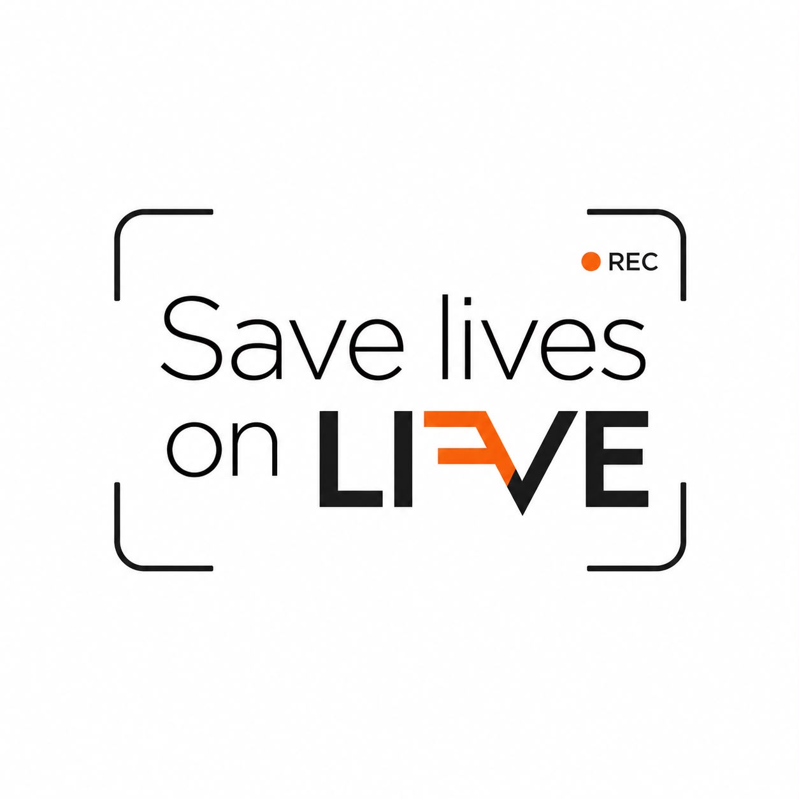
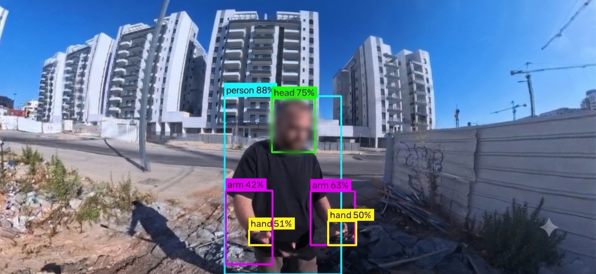

# SLOL - Save Lives On Live

<p align="center">
  
</p>

## Real-Time Life-Saving Detection System


## Overview


SLOL is a real-time computer vision system designed to assist search-and-rescue teams in locating trapped victims in disaster environments.

The system uses a custom-trained YOLOv8s body-parts detection model to identify visible human body parts in video streams captured by standard cameras or 360-degree cameras such as the Insta360 X4.

The current system extends the original detection pipeline into a live field architecture:

* An Android field application connects to an Insta360 X4 over Wi-Fi.
* The Android device displays the live camera preview.
* The Android device sends selected live frames to the main cloud server.
* The server runs YOLO inference on Google Cloud.
* The server returns bounding boxes to the Android device.
* The same detections are also published to a Command Center dashboard.

The goal is to support both real-time detection on the rescuer's device and centralized situational awareness for a command center.

> GitHub note: private model weights, local credentials, build outputs, scenario recordings, and demo videos are intentionally excluded from the repository. Authorized users receive model files separately from the project owner.

---

## Project Goal

During disaster response operations, rescuers often need to inspect large areas quickly while searching for signs of trapped individuals.

This project aims to:

* Detect human body parts in real time
* Highlight potential victims directly on the Android field device
* Support Insta360 X4 live preview through Android
* Send live frames from Android to a cloud inference server
* Return detection boxes to Android with minimal delay
* Display live detection events in a Command Center dashboard
* Support simulated multi-camera presentation feeds
* Enable future model improvement through controlled scenario recording
* Reduce search time and improve situational awareness

---

## Supported Classes

| Class  | Description     |
| ------ | --------------- |
| hand   | Human hand      |
| arm    | Human arm       |
| head   | Human head      |
| leg    | Human leg       |
| foot   | Human foot      |
| person | Full human body |

---

## System Architecture

### Original Detection Pipeline

The original detection system was structured as a camera-to-server inference pipeline:

```text
Camera / Insta360
        |
        v
OpenCV Client
        |
        v
FastAPI Detection Server
        |
        v
YOLOv8 Model
        |
        v
Bounding Boxes + Confidence Scores
        |
        v
Live Visualization
```

This pipeline supported live camera/video processing and visual detection output.

### Current Unified Live Architecture

The current version keeps the same detection concept, but replaces the local OpenCV client role with an Android field device and adds a Command Center dashboard.

```text
Insta360 X4 Camera
        |
        | Wi-Fi live preview
        v
Android Field Application
        |
        | JPEG frames over WebSocket
        v
Google Cloud Main WebSocket Server
        |
        +-- YOLOv8s / PyTorch / TensorRT inference
        |
        +-- returns bounding boxes to Android
        |
        +-- publishes detection events to Command Center
        v
Live Visualization
        |
        +-- Android on-device overlay
        +-- Command Center dashboard
```

The Android application does not communicate with a separate dashboard server. It sends frames only to the main WebSocket server. The main server runs inference once and distributes the result to both Android and the Command Center.

---

## Runtime Roles

### Android Field Device

The Android application is the real field client.


It is responsible for:

* Connecting to the Insta360 X4 over Wi-Fi
* Showing the live camera preview on the phone
* Extracting preview frames from the displayed camera stream
* Sending frames to the cloud server
* Receiving detections from the cloud server
* Drawing bounding boxes on the Android screen
* Optionally sending start/stop recording commands for data collection

### Google Cloud Main Server

The main inference server is deployed on Google Cloud.

It is responsible for:

* Receiving frames from one or more Android devices
* Running the trained YOLO model
* Returning detections to the correct Android device
* Publishing live detection events to the Command Center dashboard
* Serving the dashboard UI
* Running optional demo feeds only when a dashboard event is active
* Saving temporary scenario data only when recording is explicitly requested

### Command Center Dashboard

The Command Center is served by the main server.

It is responsible for:

* Displaying multiple camera feeds in a unified visual layout
* Showing simulated feeds for project presentation
* Showing the Android/Insta360 live feed as a real field device
* Displaying detection frames, crops, classes, confidence scores, and timestamps
* Allowing operators to start and close a dashboard event

The dashboard is not a second inference server for Android frames. It displays detection events that were already computed by the main server.

---

## Communication Protocol

### Android to Server

Android connects to the main server over WebSocket:

```text
ws://<SERVER_HOST>:8000/ws/<client_id>?camera_name=<camera_name>
```

Android sends JPEG frames as binary WebSocket messages.

The server replies with JSON detection messages:

```json
{
  "type": "detections",
  "client_id": "android_phone",
  "detections": [
    {
      "class_id": 2,
      "class_name": "head",
      "confidence": 0.76,
      "bbox": [120, 80, 220, 210]
    }
  ],
  "latency_ms": 12.9,
  "timestamp": 1784560000.123,
  "frame_count": 30
}
```

The bounding box coordinates are absolute pixel coordinates relative to the frame sent by Android.

### Server to Command Center

The dashboard browser connects to the main server over WebSocket:

```text
ws://<SERVER_HOST>:8000/dashboard/ws
```

The dashboard receives messages such as:

```text
hello
frame_update
detection
validation
event_started
event_closed
```

The dashboard receives detection results that were already computed by the main server.

---

## Command Center Behavior

The Command Center can show simulated feeds and real live field detections in the same visual layout.

For project presentation, simulated feeds can be used to represent additional rescue teams. The Android/Insta360 feed represents a real connected field device.

All feeds are displayed with the same card design and detection visualization. The source can be different, but the operator experience remains unified.

### No Dashboard Event Active

```text
Android frames -> YOLO -> detections back to Android
```

In this mode:

* Android continues working normally
* No simulated dashboard feeds are processed
* No dashboard display artifacts are written
* The server only processes frames that Android actually sends

### Dashboard Event Active

After the operator starts an event:

```text
Android frames -> YOLO -> Android overlay + dashboard live feed
Simulated feed frames -> YOLO -> dashboard presentation feeds
```

This allows the system to demonstrate multi-camera command-center behavior while still preserving a real Android/Insta360 live connection.

---

## Dataset

The model was trained on a custom body-parts dataset created specifically for disaster-response scenarios.

### Dataset Characteristics

* Thousands of annotated body-part instances
* Positive and negative samples
* Real-world rescue-like environments
* Multiple body-part classes
* Background-only images to reduce false positives
* Images derived from 360-degree footage and selected viewing angles
* Cluttered environments intended to resemble rescue and rubble scenarios

### Approximate Class Distribution

| Class  | Objects |
| ------ | ------: |
| Hand   |   1000+ |
| Arm    |    700+ |
| Head   |    800+ |
| Leg    |    700+ |
| Foot   |    600+ |
| Person |    500+ |

---

## Model Performance

Best validation results achieved during training:

| Metric    | Value |
| --------- | ----: |
| Precision |  0.90 |
| Recall    |  0.88 |
| mAP@50    |  0.93 |
| mAP@50-95 |  0.49 |



### Runtime Notes

The production inference path runs on the cloud server. The Android device sends frames and receives bounding boxes; it does not run the YOLO model locally.

The server uses `imgsz=960` for YOLO inference. Source frame dimensions and YOLO inference size are separate runtime concerns. Measure actual runtime behavior through `/stats` and environment-specific benchmarks instead of relying on fixed FPS claims.

---

## Model Weights and Runtime Formats

The trained model is stored as a PyTorch YOLO model:

```text
best.pt
```

On Google Cloud, the model can be exported to TensorRT:

```text
best.engine
```

Model weights are private. Authorized local handoff packages may include `best.pt`, but model files must not be committed to Git. The repository `.gitignore` excludes `.pt`, `.engine`, `.onnx`, and exported model formats.

The server loads `best.engine` when available. If it does not exist, it falls back to `best.pt`.

Current inference settings:

```text
IMAGE_SIZE = 960
CONFIDENCE_THRESHOLD = 0.35
IOU_THRESHOLD = 0.45
```

---

## Scenario Recording

Scenario recording is a temporary data-collection tool for future YOLO retraining. It is not part of the permanent operational Command Center flow.

When Android sends a start-recording command, the server creates:

```text
data_collection/scenario_XXX/
├── images/
├── labels/
├── annotated/
└── metadata.json
```

For each saved frame:

* `images/` contains the clean original frame
* `labels/` contains YOLO-format labels
* `annotated/` contains a copy with boxes drawn for review

This data can later be downloaded, reviewed, corrected, and used to improve the model.

---

## Important Endpoints

| Purpose | Endpoint |
| ------- | -------- |
| Android live WebSocket | `/ws/{client_id}` |
| Dashboard page | `/dashboard` |
| Dashboard WebSocket | `/dashboard/ws` |
| Dashboard info | `/dashboard/api/info` |
| Start dashboard event | `/dashboard/api/events/start` |
| Close dashboard event | `/dashboard/api/events/close` |
| Server stats | `/stats` |
| Recording status | `/recording/status` |

---

## Local Run

Run the unified server locally:

```bash
cd websocket_server
source <VENV_PATH>/bin/activate
python server_websocket.py
```

Open the dashboard:

```text
http://127.0.0.1:8000/dashboard
```

If using local simulated video feeds, configure the demo video directory before starting the server:

```bash
export RESCUE360_DEMO_VIDEO_DIR=<LOCAL_DEMO_VIDEO_DIR>
python server_websocket.py
```

---

## Google Cloud Run

The main inference server is deployed on a Google Cloud GPU VM using a G2 machine family instance with an NVIDIA L4 GPU.

During development, the server can still be started manually:

```bash
cd ~/websocket_server
source ~/rescue360-env/bin/activate
python server_websocket.py
```

For a stable cloud deployment, the server should run as a Linux `systemd` service.
In the current VM setup, the service name is:

```text
slol.service
```

This service runs the same Python server from the same project directory:

```text
<VM_HOME>/websocket_server/server_websocket.py
```

using the existing Python environment:

```text
<VM_HOME>/rescue360-env
```

### SLOL Service Management

Check service status:

```bash
sudo systemctl status slol
```

Start the service:

```bash
sudo systemctl start slol
```

Stop the service:

```bash
sudo systemctl stop slol
```

Restart after code changes:

```bash
sudo systemctl restart slol
```

View live logs:

```bash
journalctl -u slol -f
```

View recent logs:

```bash
journalctl -u slol -n 100
```

The service is enabled with `systemd`, so it starts automatically when the VM boots:

```bash
sudo systemctl enable slol
```

### Service Behavior

The cloud runtime currently uses a Google Cloud G2 instance with an NVIDIA L4 GPU.
The `slol.service` systemd unit controls the existing server process on that VM and starts it automatically when the VM boots.

After switching to `systemd`, do not run this manually at the same time:

```bash
python server_websocket.py
```

Use this instead after changes:

```bash
sudo systemctl restart slol
```

### Cloud Endpoints

Open the dashboard:

```text
http://<SERVER_HOST>:8000/dashboard
```

Android should connect to:

```text
ws://<SERVER_HOST>:8000/ws/<client_id>?camera_name=<camera_name>
```

Local health check on the VM:

```bash
curl http://127.0.0.1:8000/stats
```

The VM must allow inbound traffic on port `8000`.

---

## Project Structure

Current unified server folder:

```text
websocket_server/
├── server_websocket.py
├── benchmark_video_inference.py
├── best.pt                     # private, authorized local handoff only, ignored by Git
├── best.engine                 # optional TensorRT export, ignored by Git
├── dashboard_static/
│   ├── index.html
│   ├── style.css
│   └── app.js
├── dashboard_outputs/          # generated runtime display images, ignored by Git
├── data_collection/            # optional scenario recordings, ignored by Git
├── debug_frames/               # runtime debug frames, ignored by Git
├── demo_videos/                # optional presentation videos, ignored by Git
├── requirements_websocket.txt
├── requirements_unified.txt
└── README.md
```

Android source code remains outside the cloud runtime. The installed APK only needs the cloud WebSocket address.

---

## Technologies Used

### Computer Vision and Machine Learning

* YOLOv8s
* PyTorch
* Ultralytics
* TensorRT for optimized cloud inference
* OpenCV
* NumPy

### Backend

* Python
* FastAPI
* Uvicorn
* WebSocket communication
* JSON control and detection messages

### Mobile

* Android
* Kotlin
* Insta360 Android SDK
* Insta360 X4 Wi-Fi preview

### Dashboard

* Browser-based Command Center
* HTML
* CSS
* JavaScript
* WebSocket updates from the main server

### Deployment

* Local development on macOS
* Google Cloud GPU VM for inference

---

## Storage Notes

The unified server is designed to keep cloud storage small.

The dashboard writes lightweight display files under:

```text
dashboard_outputs/
```

These files are for dashboard display only and are not training data.

To avoid unnecessary cloud storage usage:

* Keep simulated presentation videos local unless they are specifically needed on the cloud VM
* Keep scenario recording off unless collecting data
* Clean old `dashboard_outputs/` periodically
* Clean old `data_collection/` after downloading scenarios

---

## Authors

### Omer Bender

Computer Science Student  
Machine Learning & Computer Vision Developer

### Eithan Shaoat

Project Contributor

---

## Disclaimer

This project is intended for educational, research, and prototype rescue-assistance purposes only.

It is not certified for operational emergency use.
