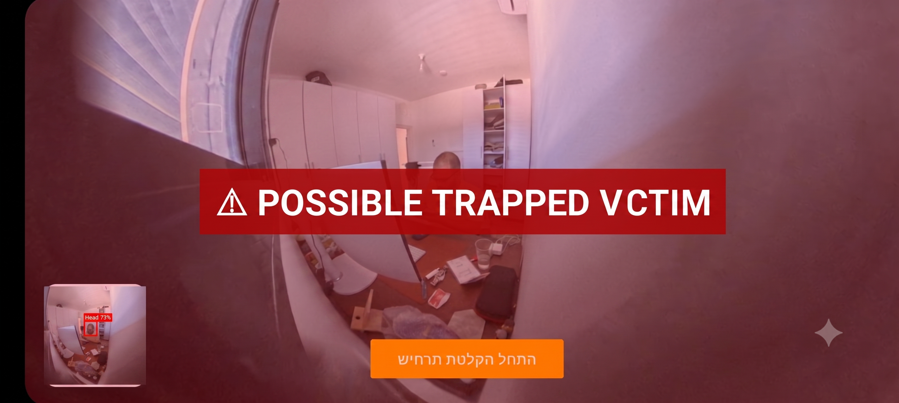

# SLOL Android Field App

<p align="center">
  
</p>

This folder contains the Android field-device client for SLOL.

The app connects to an Insta360 X4 over Wi-Fi, displays the live preview, sends selected JPEG frames to the cloud WebSocket server, receives YOLO detection results, and draws bounding boxes on the Android screen.



---

## Responsibilities

* Connect to the Insta360 X4 Wi-Fi network
* Display the Insta360 live preview on the Android device
* Send JPEG frames to the cloud server over WebSocket
* Receive detection results from the server
* Render detection overlays on screen
* Send optional start/stop recording control messages to the server

The Android app does not include the YOLO model. Inference runs on the server.
---

## Configuration

Copy:

```text
gradle.properties.example
```

to:

```text
gradle.properties
```

Then configure safe local values:

```properties
INSTA360_MAVEN_USERNAME=your_username
INSTA360_MAVEN_PASSWORD=your_password
RESCUE360_SERVER_WS_URL=ws://<SERVER_HOST>:8000/ws
INSTA360_X4_WIFI_PASSWORD=
```

Private values must remain local and must not be committed to Git.

---

## Insta360 SDK

The Android project uses the Insta360 Android SDK Maven repository configured in `settings.gradle.kts`.

SDK credentials are read from Gradle properties or environment variables:

```text
INSTA360_MAVEN_USERNAME
INSTA360_MAVEN_PASSWORD
```

Authorized access is required from the project owner / Insta360 account.

---

## Server URL

The WebSocket base URL is configured with:

```text
RESCUE360_SERVER_WS_URL
```

Base URL format configured in Android:

```text
ws://<SERVER_HOST>:8000/ws
```

The final WebSocket route used by the server is:

```text
ws://<SERVER_HOST>:8000/ws/<CLIENT_ID>?camera_name=<CAMERA_NAME>
```

The app appends the Android client identity when connecting to the server.

---

## Build

From the Android folder:

```bash
./gradlew :app:assembleDebug
```

Install on a connected Android device:

```bash
adb install -r app/build/outputs/apk/debug/app-debug.apk
```

A physical Android device is required for the intended Insta360 Wi-Fi workflow.

---

## Local Server Testing

For local testing through USB ADB reverse:

```bash
adb reverse tcp:8000 tcp:8000
```

Then configure:

```text
RESCUE360_SERVER_WS_URL=ws://127.0.0.1:8000/ws
```

---

## Network Notes

The Insta360 X4 Wi-Fi connection can affect normal internet routing on some Android devices. For cloud testing, the device needs a working path to both the camera Wi-Fi preview and the cloud WebSocket server, for example through mobile data or device-specific network settings.

---

## Files Excluded from Git

The repository excludes Android local and generated files such as:

* `gradle.properties`
* `local.properties`
* `.gradle/`
* `build/`
* APK/AAB outputs
* Private SDK credentials

---

## Related Documentation

* Root project overview: [`../README.md`](../README.md)
* Architecture: [`../docs/architecture.md`](../docs/architecture.md)
* WebSocket protocol: [`../docs/websocket-protocol.md`](../docs/websocket-protocol.md)
* Deployment: [`../docs/deployment.md`](../docs/deployment.md)
