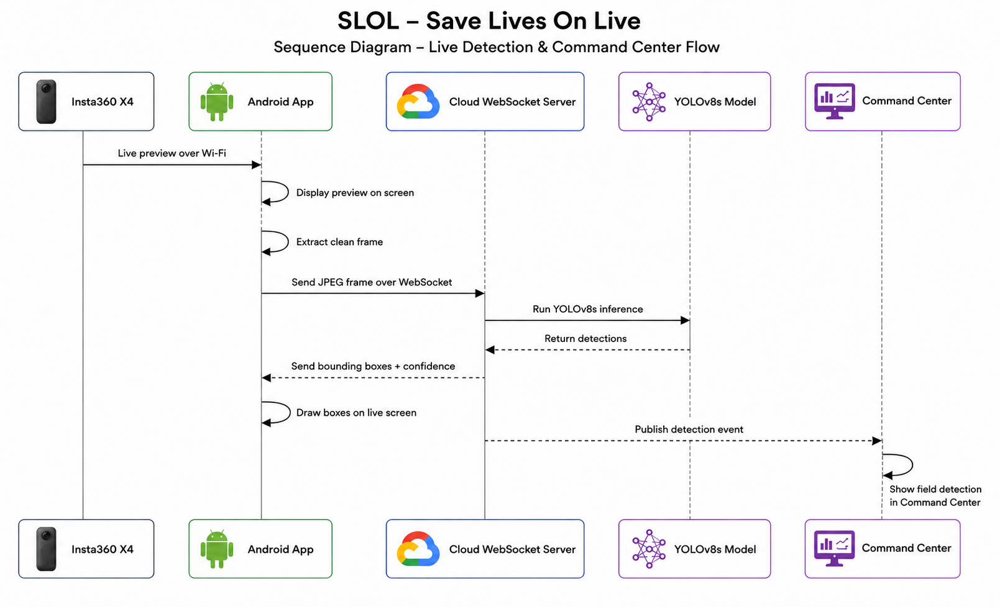

# SLOL Architecture

This document describes the implemented SLOL architecture as represented by the public repository.

## Components

### Android Field Application

The Android application is the real field client. It connects to an Insta360 X4 camera over Wi-Fi, displays the camera preview, sends JPEG frames to the server over WebSocket, receives detection messages, and draws bounding boxes on screen.

The Android app does not contain or run the production YOLO model locally. Production inference runs on the server.

### Main WebSocket Server

The Python FastAPI server receives frames from Android clients, runs YOLO inference, returns detections to the correct Android client, and publishes detection events to the Command Center dashboard.

The server entry point is:

```text
websocket_server/server_websocket.py
```

The server loads `best.engine` when it exists in `websocket_server/`; otherwise it falls back to `best.pt` in the same folder.

### Command Center Dashboard

The dashboard is served by the same FastAPI server. It is not a separate inference server.

The dashboard can display:

* Real Android/Insta360 detection events
* Simulated presentation feeds from local demo videos
* Detection images, crops, classes, confidence scores, timestamps, and validation state

Simulated feeds are processed only when a dashboard event is active.

````markdown
## Data Flow

```text
Insta360 X4
      |
      | Wi-Fi preview
      v
Android Field Application
      |
      | binary JPEG WebSocket frames
      v
FastAPI WebSocket Server
      |
      +--> YOLOv8s inference
      |
      +--> JSON detections back to Android
      |
      +--> dashboard event updates
      v
Android Overlay + Command Center Dashboard
## Live Detection Sequence

The following sequence diagram illustrates the complete live detection flow from the Insta360 X4 camera to the Android overlay and Command Center dashboard.

<p align="center">
  
</p>

---
## Real Versus Simulated Sources

The Android/Insta360 source represents the real field-device pipeline.

The dashboard demo feeds represent additional teams for presentation and testing. They are local video files processed by the server only after a dashboard event is started.

## Inference Flow

For each Android binary WebSocket frame:

1. The server decodes the JPEG frame with OpenCV.
2. The YOLO model runs with the configured inference constants in `server_websocket.py`.
3. The server converts model outputs to class ID, class name, confidence, and absolute pixel bounding boxes.
4. The server sends detections back to Android.
5. The same processed result can be sent to the dashboard.

## Recording Flow

Scenario recording is a controlled data-collection feature for later dataset improvement.

When an Android client sends `start_recording`, the server creates a scenario folder under:

```text
websocket_server/data_collection/
```

For saved frames, the server writes:

```text
scenario_XXX/
├── images/
├── labels/
├── annotated/
└── metadata.json
```

The clean original frame and the annotated review image are saved separately.

## Current Deployment Note

The repository keeps the folder name `websocket_server` because the current Google Cloud VM deployment and systemd service use that path. Renaming it would require a coordinated deployment update.
